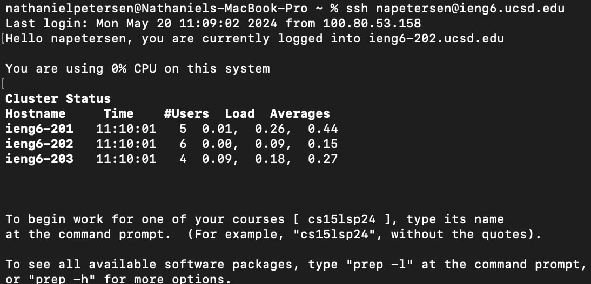
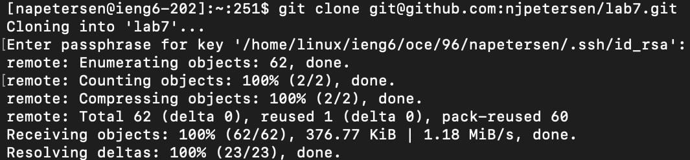
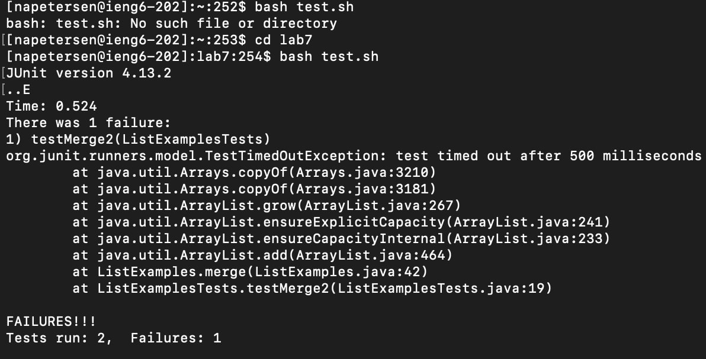
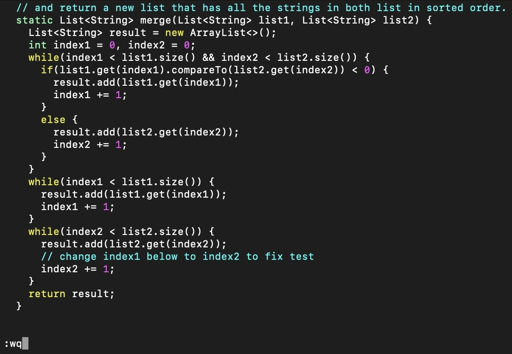
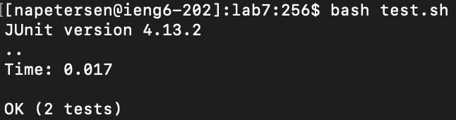
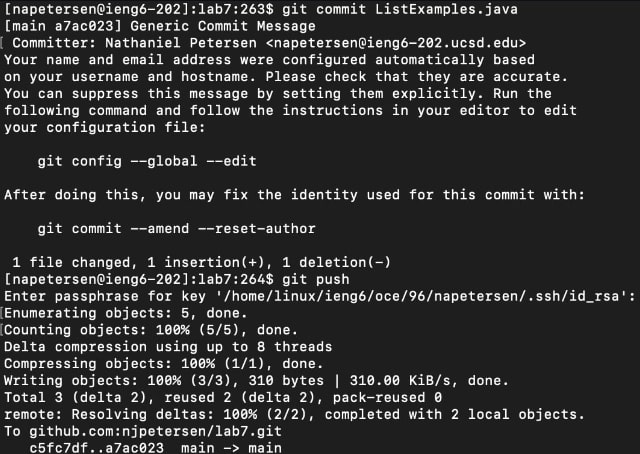

# Lab Report 4
Hello, my name is Nathaniel Jay Petersen, PID: A17832207 and this page will reproduce steps 4-9 of the Vim practice task from lab 7.

## Step 4: Log into ieng6

Keys Pressed: `<up><enter>`

The `ssh napetersen@ieng6.ucsd.edu` command was one up in the search history, so I pressed the up arrow to access it. I then ran the command with the enter key, allowing me to access the remote ieng6 server.

## Step 5: Clone the github repo

Keys Pressed: `<up><up><up><up><up><up><up><enter>` (also typed in a password afterwards)

The `git clone git@github.com:njpetersen/lab7.git` command was seven up in the search history, so I pressed the up arrow seven times to access it. I then ran the command with the enter key, prompting me to enter my password, which I do, allowing the command to clone the forked github repo "lab7" into the current working directory on my ieng6 account.

## Step 6: Demonstrate that the Junit tests fail

Keys Pressed: `<up><up><up><up><up><enter>`,`cd lab7` `<enter>`,`<up><up><enter>`

The `bash test.sh` command was five up in the search history, so I pressed the up arrow five times to access it. I then ran the command with the enter key, but I was in the wrong directory, so the command returned an error. To fix this, I typed in the command `cd lab7` and ran it with the enter key, switching my active working directory to lab7. This meant the `bash test.sh` command was not two up in the search history, so I pressed the up arrow two times to access it once again. I then ran the command with the enter key, which ran a bash script that in turn ran two Junit tests, one of which failed.

## Step 7: Edit the code to fix the failing test

Keys Pressed: `<up><up><up><up><up><up><up><up><up><enter>`,`/cha <enter>`,`<down><right><right><r2><:wq><enter>`

The `vim ListExamples.java` command was nine up in the search history, so I pressed the up arrow nine times to access it. I then ran the command with the enter key, opening up the file `ListExamples.java` in Vim. Once in Vim, I searched for the key phrase `cha` using the command `/cha` and then pressing the enter key. I then pressed the down key once and then the right key twice in order to position my cursor over the single character that needed to be changed. I then pressed the r key to tell Vim to replace the character 1, and then the 2 key to actually replace the character with 2. I then typed and ran the command `:wq` with the enter key to exit Vim and save my changes.

## Step 8: Demonstrate that the Juint tests now pass

Keys Pressed: `<up><up><enter>`

The `bash test.sh` command was two up in the search history, so I pressed the up arrow two times to access it. I then ran the command with the enter key, which ran a bash script which in turn ran the same two Junit tests from before, both of which passed, confirming the change made to the `ListExamples.java` file fixed the error.

## Step 9: Commit and Push changes to my Github account

Keys Pressed: `<up><up><up><up><up><up><up><up><up><up><up><up><up><up><up><enter>`,`i <down><down><down><down><down><down><down><down><down><down><down><enter> Generic Commit Message <esc> :wq`,`<up><up><up><up><up><up><up><up><up><up><up><up><up><up><up><enter`

The `git commit ListExamples.java `

In vim, press i, down 11, enter, write "Generic Commit Message", esc, :wq

up 15 for git push

